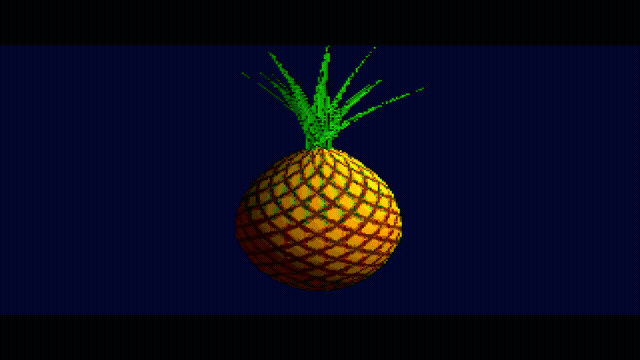
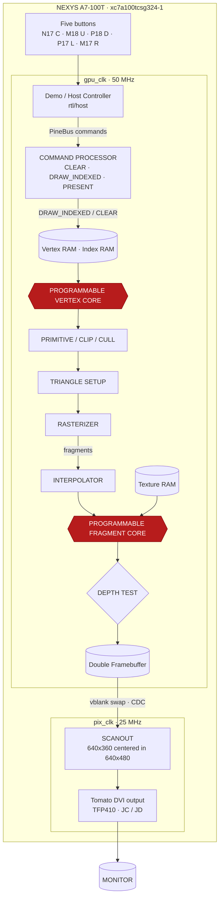
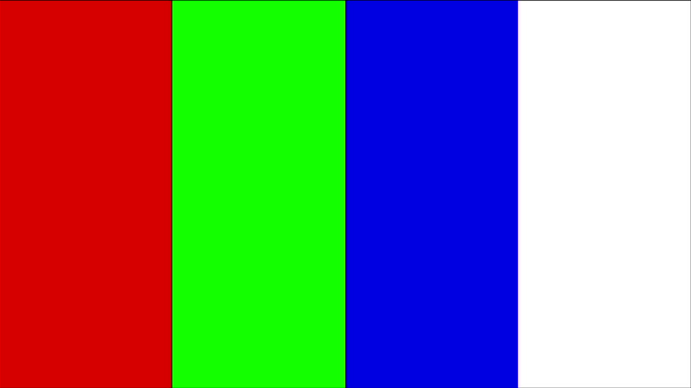

# Pineapple GPU P1

<p align="center">
  <a href="docs/validation.md"></a>
  <a href="docs/architecture.md"></a>
  <a href="docs/shader_upload.md"></a>
  <a href="#build-and-run"></a>
  <a href="LICENSE"></a>
</p>

A standalone programmable 3D GPU for the Nexys A7-100T. The frozen
[P1 brief](docs/p1-specification.md) defines the target; the pineapple is an asset,
not special-purpose rendering logic.

<h3 align="center">Actual HDMI Render Output captured in <a href="https://open-vsx.org/extension/tmarhguy/frameport">Frameport v0.2.4</a></h3>

<div align="center">
  
</div>

**Current implementation: full P1 GPU (v0.3.0).** Programmable vertex/fragment
shaders, rasterizer, depth, texture, double-buffered presentation and demo host
are implemented and verified — see [validation](docs/validation.md). Both the
pineapple (`make program`) and the cube (`make program-cube`, unchanged GPU RTL)
have rendered on silicon. The bring-up test pattern is preserved as
`rtl/board/bringup_top.v` for diagnostics.

## Architecture



Five D-pad buttons drive a demo host (`rtl/host/`) that submits
`CLEAR` / `DRAW_INDEXED` / `PRESENT` over PineBus. The GPU (`rtl/gpu/`)
fetches indexed vertices, runs them through the programmable vertex core,
culls, sets up triangles, rasterizes with a top-left edge walker,
interpolates perspective-correct attributes, runs the programmable fragment
core against texture RAM, depth-tests, and presents a double-buffered
320×180 RGB444 frame scanned out as 640×360 centered in 640×480 DVI.
Every node maps to exact files, clocks, pins and BRAM budgets in the
[NEXYS A7-100T contract](docs/architecture.md); PineBus registers,
the 17-op shader ISA and the fixed-point rules are specified in
[registers](docs/registers.md), [shader ISA](docs/shader_isa.md) and
[fixed point](docs/fixed_point.md).

Before the GPU first rendered, the DVI path was validated with a
red/green/blue/white band test pattern:

<div align="center">
  
  <br>
  <em>Bring-up test pattern (<code>rtl/board/bringup_top.v</code>)</em>
</div>

## Build and run

```
make test     # fast unit suites (Icarus)
make verify   # pixel-exact RTL-vs-reference frames (minutes)
make fpga
make program
```

Icarus Verilog is required for tests. FPGA targets include the existing Tomato
flow at `../tomato/hardware/fpga/common.mk`; override `TOMATO_FPGA=/absolute/path`
if needed. Its `scripts/env.sh` selects the installed Yosys, nextpnr-xilinx,
Project X-Ray and openFPGALoader environment. Target: `xc7a100tcsg324-1`.
No Vivado or CPU firmware is required. `make program` loads volatile FPGA SRAM;
it does not install a power-on flash image.

Connect the existing 12-bit TFP410 PMOD across JC/JD. Output is 640×480 at
25 MHz / (800×525) = 59.524 Hz. The GPU renders 320×180 centered between
60-line black bars. D-pad orbits/pitches, center+up/down zooms, center taps
cycle the six shader modes. CPU_RESETN resets the design.

## Layout and next steps

`rtl/board/` contains clock/reset, keypad, timing and DVI output.
`rtl/gpu/`, `rtl/host/` and `rtl/memory/` hold the graphics processor, demo
host and framebuffer/texture memories. `rtl/cube_top.v` re-targets the same
GPU at the cube asset (`make fpga-cube` / `make program-cube`). `tb/` checks
units, full frames and button behavior. Remaining: physical D-pad confirmation.
Measured frame loop at 50 MHz: ≈37 fps cube, ≈25 fps pineapple.

See [milestones](docs/milestones.md) and [reuse provenance](docs/provenance.md).
Every milestone requires Icarus checks;
hardware changes also require synthesis. Bit-accurate Python reference behavior
must precede the rasterizer and shader RTL. The ten-stage implementation order
in the brief is preserved.

## Changelog and license

See [CHANGELOG.md](CHANGELOG.md). MIT only, see [LICENSE](LICENSE) — personal
project, you may copy with attribution.
