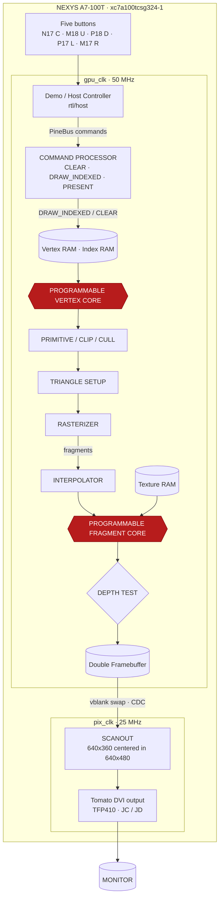

# Architecture contract — NEXYS A7-100T

Part: `xc7a100tcsg324-1` (101K LC, 135 RAMB36, 240 DSP48E1).
Board: 100 MHz oscillator on E3, red `CPU_RESETN` on C12,
five D-pad buttons, USB-UART `RsRx` on C4,
12-bit TFP410 DVI PMOD across JC/JD. No CPU, no DDR, no flash image —
`make program` loads volatile SRAM only.

P1 is an accelerator: PineBus command submission → indexed vertex fetch →
programmable vertex shader → primitive assembly/cull/setup → top-left edge
rasterizer → perspective interpolation → early Z → programmable fragment shader
and texture unit → RGB444 back buffer → vblank presentation → board scanout.
`rtl/gpu/` holds the graphics processor and must never know board pins or asset
identity. `rtl/board/` owns clocks, buttons, timing and DVI pins.
`rtl/host/` (demo FSM + camera) is the first PineBus host; a future RISC-V /
USB / PCIe host replaces it without touching `rtl/gpu/`. See
[registers](registers.md), [shader ISA](shader_isa.md),
[fixed point](fixed_point.md), [P1 brief](p1-specification.md).

## System map: every diagram box → file, clock, width



All GPU logic runs on `gpu_clk` (50 MHz). All scanout logic runs on `pix_clk`
(25 MHz). The only crossing is the framebuffer swap + scanout read.

```text
NEXYS A7-100T (xc7a100tcsg324-1), 100 MHz E3 ─┬─ div/2 ─► gpu_clk 50 MHz (GPU, host, keypad, UART)
                                              └─ div/4 ─► pix_clk 25 MHz (scanout, DVI, vblank)
```

| Diagram node | RTL | Domain | Notes |
|---|---|---|---|
| Five buttons | `rtl/board/keypad.v`, `rtl/host/camera_controller.v` | `gpu_clk` | 2-flop sync, ~1.31 ms tick (`SAMPLE=16`), ~16 ms debounce, arrows autorepeat, center no-repeat. Outputs `yaw[4:0] pitch[3:0] zoom[1:0] mode[2:0]`. Pins N17 C, M18 U, P18 D, P17 L, M17 R |
| Demo / Host Controller | `rtl/host/demo_host.v` | `gpu_clk` | Per-frame PineBus program: `INDEX_COUNT`, clear color, light/uniform constants, 16 MVP words from `assets/camera.mem`, `FS_PROGRAM` from D-pad mode, then `CLEAR → DRAW_INDEXED → PRESENT`. `hold` input freezes it mid-stream during shader upload |
| PineBus commands | `rtl/gpu/pineapple_gpu.v:109-164` | `gpu_clk` | `addr[15:0] wdata[31:0] write valid → ready` (+ combinatorial read, always ready). Writes commit only in `state==0` (idle). Full map: [registers](registers.md) |
| COMMAND PROCESSOR | `pineapple_gpu.v` states 0/1/40/41/42 | `gpu_clk` | Folded into the GPU FSM, not a separate module: `CLEAR` fills 57,600 color words + `0xFFFF` depth (state 1), `DRAW_INDEXED` validates count (`serial mod-3`, state 42 — `%` inferred a ~32 ns divider and missed timing), `PRESENT` handshakes `render_target` and counts `frame_cycles` (states 40/41) |
| Vertex RAM / Index RAM | `pineapple_gpu.v:18-26` | `gpu_clk` | `index_mem[16384]×16`, `vertex_mem[2048]×144` (`{uv, normal, pos}`), `(* rom_style="block" *)`, `$readmemh` at build. 2-cycle fetch: index → vertex (states 2/3). Bounds-checked (`index<2048`, `base+index<2048`), violations raise `error` |
| PROGRAMMABLE VERTEX CORE | `rtl/gpu/shader_core.v` (`program_base=vs_base`) | `gpu_clk` | Shared Pine core, ~5 cycles/instruction. ABI: `in0={1.0, x,y,z} in1={0, nx,ny,nz} in2={0,0, u,v}` → `out0=clip out1=normal out2=uv`. ISA: [shader ISA](shader_isa.md) |
| PRIMITIVE / CLIP / CULL | `pineapple_gpu.v` states 5/8/9/13 | `gpu_clk` | `w<512/4096` clip kill, viewport reject outside ±1024, zero-area kill, `cull`-gated backface kill, CCW winding repair by corner swap. Near-plane clipping is NOT implemented — the demo camera is constrained to never cross it (brief §6) |
| TRIANGLE SETUP | `pineapple_gpu.v` states 10/11 + `rtl/gpu/reciprocal.v` | `gpu_clk` | `1/|area|` via 32-cycle restoring divider (`2^30 / (area<<2)`), `q=min(131071, 2^24/w)` per vertex, viewport `160+(px·160)>>24 / 90−(py·90)>>24`, `z=(pz·q)>>8` clamped to 16 bits |
| RASTERIZER | `rtl/gpu/rasterizer.v` | `gpu_clk` | Standalone module. Pixel-center edge walker, top-left fill rule, bbox clamped to 320×180, edge steps scaled ×4. Streams while `ready=(state==20)`; `valid` = inside all three edges. `busy/done` bracket each triangle |
| INTERPOLATOR | `pineapple_gpu.v` states 21/22/36/23 | `gpu_clk` | Folded in, not a separate module. 7 attributes (`z q uq vq nx ny nz`), one component per 3-cycle pass (`22→36→23`, ~21 cycles/fragment). 32×32 products split lo/mid so `-nodsp` fabric multiplies stay shallow |
| Texture RAM | `rtl/memory/texture_mem.v` | `gpu_clk` | 256×256 RGB444, 4 texels per 48-bit word, 16,384 words, 2-cycle slice read. Read-only during draw, so it packs cleanly |
| PROGRAMMABLE FRAGMENT CORE | `shader_core.v` (`program_base=fs_base`) + `shader_loader.v` + `uart_rx.v` | `gpu_clk` | Same core reused. Per-fragment ABI: `in0={1,0,v,u} in1={0,nz,ny,nx} in2={1,z,z,z}` → `out0=rgb`. Runtime upload over `RsRx`/C4 (115200 8N1) stages off-line and commits on a GPU-idle boundary; see [upload](shader_upload.md) |
| DEPTH TEST (early Z) | `pineapple_gpu.v` states 24/31, `zmem[57600]×16` | `gpu_clk` | Interpolated `z >= zread` fails (nearer wins, clear = `0xFFFF` far), `q<=0` fails. Pass → fragment shader → color+z write. Single fragment in flight, so no Z hazard |
| Double Framebuffer | `rtl/memory/render_target.v` | `gpu_clk` + `pix_clk` | 2× 57,600×12 banks. GPU writes `back`, display reads `front`; `PRESENT` swaps at `vblank_start` only, via 2-flop `request/ack` CDC. `display_valid` gates the first frame to black until a swap lands |
| SCANOUT | `rtl/board/gpu_scanout.v` + `rtl/pineapple_top.v:25-31` | `pix_clk` | 800×525 timing (`hs/vs/de/vblank_start`), pixel-doubled `640×360` centered in 640×480 (`scan_addr=(y−60)/2·320+x/2`, 60-line bars). Output: 640×480 @ 25 MHz/(800×525) = **59.524 Hz** |
| Tomato DVI output | `rtl/board/dvi_out.v` | `pix_clk` | 12-bit payload registered, clock forwarded through `ODDR` (`SAME_EDGE`). JC = R/G, JD = B + clk/hs/vs/de — pin table in `constr/nexys.xdc` |

Second asset (`rtl/cube_top.v`) is parameters only (`ASSET`, `INDEX_COUNT`) —
`rtl/gpu/` is untouched between pineapple and cube builds (v0.3.0 proof).

## PineBus in one paragraph

Write-only command stream plus combinatorial status/counter reads; the full
address map (STATUS/CLEAR/VERTEX_BASE/INDEX_BASE/INDEX_COUNT/VS/FS/CULL,
uniform window `0x100…`, COMMAND `0x50`, counters `0x20…0x4C`) is specified in
[registers](registers.md). The demo host is the only writer today.

## Shaders in one paragraph

One vector ISA, two stages, 16×vec4 S18Q12 registers, 17 straight-line opcodes
(`END MOV LDI LDU ADD SUB MUL MAD DP3 DP4 MIN MAX SAT CMP SEL TEX2D OUT`),
64 instructions and 512 program words (8 slots × 64); vertex ABI
`{clip, normal, uv}`, fragment ABI `{1,0,v,u}/{0,n}/{1,z}`. Encoding,
semantics and the six showcase fragment modes are specified in
[shader ISA](shader_isa.md); number formats in [fixed point](fixed_point.md).

## Memory / BRAM budget (measured, not bit-counted)

Payload alone is 3,090,432 bits (2× 57,600×12 color + 57,600×16 depth +
65,536×12 texture ≈ 84 RAMB36 at ideal packing). The brief requires checking
physical packing, not bit counts — port width/depth rounding plus index,
vertex, shader, uniform and camera tables cost the rest. Measured post-route
(v0.2.0): **22% LUT, 42% RAMB18, 41% RAMB36** of the 100T's 135 RAMB36, with
synthesis `-nodsp` (the installed nextpnr-xilinx cannot reliably route the
mapped DSP carry ports, so 18×18 multiplies stay in fabric by choice, not by
accident). Any capacity claim must cite a post-route report, never a bit total.

## Timing / performance (measured, not promised)

- `make fpga` post-route: `gpu_clk` **50.36 MHz** vs 50 MHz target (pineapple),
  60.88 MHz (cube), 55.43 MHz (pineapple rebuild) — `pix_clk` 120–151 MHz.
  The 50.36 MHz number is a ~0.7% margin: treat the fabric-divided
  clocks (`clock_reset.v`: 100 MHz → ÷2 gpu, ÷4 pix, `BUFG`) as proven but
  fragile. They are kept because the FOSS Yosys → nextpnr-xilinx → Project
  X-Ray flow used here has no MMCM path installed; moving to Vivado/MMCM is
  the first timing-robustness upgrade, not a functional one.
- Frame loop at 50 MHz (`frame_cycles`, host overhead included, Icarus 13.0,
  2026-10-01). Pose- and mode-dependent — fps is a measurement, not a spec:

  | workload | cycles | fps | notes |
  |---|---|---|---|
  | cube yaw 0, mode 0 (diffuse) | 1,359,877 | 36.8 | face-on: 9,120 of 18,240 fragments early-Z killed |
  | cube yaw 5, mode 0 (diffuse) | 1,835,013 | 27.2 | 14,052 shaded × ~11 instr |
  | cube yaw 5, mode 1 (normal) | 1,409,029 | 35.5 | 14,052 shaded × ~5 instr |
  | cube yaw 5, mode 2 (toon) | 1,835,013 | 27.2 | same cost class as diffuse |
  | cube yaw 5, modes 3/4/5 | 1.20–1.28 M | 39–42 | cheapest shaders |
  | pineapple showcase | 1,998,853 | 25.0 | 1,072 tris, 12,780 shaded × ~14 instr |

  Hardware `PRESENT` can add up to one 16.7 ms vblank wait on top. 30 fps is
  a measured target, never a guarantee (brief §24).
- Bottleneck attribution (pineapple frame, from counters + FSM latencies):
  shader execution ~45% (179,172 instr × ~5 cycles — irreducible, it is the
  workload), **divider-blocked reciprocal waits ~27%** (16k fragment + 3.2k
  vertex + 1k setup waits × 32 cycles; `CLEAR` is a fixed 57,600), serial
  interpolation ~17% (7 attributes × 3 cycles × 16,165 fragments), raster
  stepping and host overhead the rest. Early-Z kills 3,385 fragments before
  shading — without it the frame would cost ~25% more.
- One structural win clears 30 fps: a pipelined reciprocal (2-cycle
  throughput instead of 32-cycle blocking) removes ~0.5 M cycles → pineapple
  ≈1.5 M ≈ 33 fps. It is provably bit-exact because every numerator is a
  site constant (`2^24` for `q`, `2^30` for `1/area`) — only denominators
  vary over enumerable ranges, so exhaustive equivalence sim is feasible.
  Interpolation widening (~−11%) is the second lever, not the first.
  Pipelining either is justified only against this counter data
  (`fragments/killed/shaded/instructions/texture_requests`).

## What the diagram simplifies (honest gaps)

The brief's block diagram shows 13 discrete stages. The v0.3.0 RTL implements
all 13 functions but folds 7 into `pineapple_gpu.v`'s sequential FSM instead of
separate `command_processor / vertex_fetch / primitive_assembly /
triangle_setup / interpolator / depth_unit / framebuffer` modules, and
`vertex_mem / index_mem / shader_mem / render_target` live inside the GPU file
rather than as the `rtl/memory/` files the brief sketches. Throughput is
~1 vertex/fragment at a time with `ready/valid` backpressure only at the
rasterizer boundary — the "one candidate fragment per cycle" box is the
rasterizer's generation rate, not the pipeline's consumption rate. Splitting
the FSM into the sketched modules is the correct P2 structural step; it must
preserve pixel-exact parity with the integer golden model (`make verify`: zero
mismatches in 57,600 pixels, CRC `63134D29` pineapple / `641A94BF` cube).
