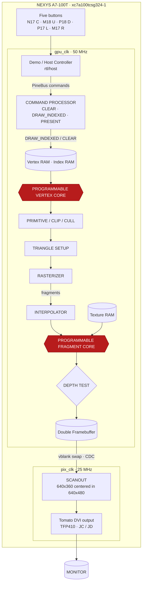

# Pineapple GPU P1 — Architectural Specification

Status: **frozen**. This document defines the P1 goals and requirements.
The as-built implementation contract (files, clocks, pins, measured budgets,
and known deviations) is recorded in [architecture](architecture.md).
Supporting specifications: [PineBus registers](registers.md),
[shader ISA](shader_isa.md), [fixed point](fixed_point.md).

## 1. Objective

P1 is a **standalone programmable 3D graphics processor for interactive
textured-mesh rendering on the Nexys A7-100T** — not a pineapple renderer.
The textured pineapple is the first showcase workload; the architecture
shall render arbitrary indexed triangle meshes (cube, teapot, spaceship)
without changes to the GPU RTL.

There is no ESP32, no soft RISC-V, and no object-specific rendering logic
in P1. The FPGA implements the graphics processor: programmable vertex
processing, triangle setup and rasterization, depth, perspective-correct
attribute interpolation, texture sampling, programmable fragment processing,
framebuffer, and presentation. A small board-side controller submits draw
commands and updates the camera from the five buttons.

## 2. System architecture



The conformance test is data-independence: `pineapple.obj` is data. The GPU
shall observe only vertices, indices, textures, uniforms, shader
instructions, and draw commands.

The software-facing command contract shall be approximately:

```text
SET_VERTEX_BUFFER
SET_INDEX_BUFFER
SET_TEXTURE
SET_VERTEX_SHADER
SET_FRAGMENT_SHADER
SET_UNIFORMS
CLEAR
DRAW_INDEXED
PRESENT
```

A state machine whose states happen to draw a pineapple is a renderer.
This specification requires a graphics processor.

## 3. Resolution

External output: **640×480 @ ~60 Hz**, the video path proven by the existing
DVI infrastructure (25 MHz pixel clock, 800×525 timing).

Internal render resolution: **320×180** (16:9), pixel-doubled to **640×360**
and centered vertically in the 640×480 signal between two 60 px black bars:

```text
640 × 480 monitor
┌─────────────────────────────────────────┐
│              black bar                  │ 60 px
├─────────────────────────────────────────┤
│                                         │
│             640 × 360                   │
│                                         │
│        2× GPU framebuffer               │
│                                         │
├─────────────────────────────────────────┤
│              black bar                  │ 60 px
└─────────────────────────────────────────┘
```

Rationale: BRAM is the P1 VRAM, so framebuffer footprint dominates the
resolution choice — not compute. At 320×180 (57,600 pixels) and 30
rendered frames/sec, the visible rate is 1.728 M pixels/sec; at a 100 MHz
GPU clock that budgets ≈57.9 cycles per visible pixel before overdraw —
sufficient headroom for a programmable pipeline.

## 4. Memory architecture

P1 treats Artix-7 block RAM as GPU VRAM:

| Memory | Format | Purpose |
|---|---|---|
| Front color buffer | RGB444 | displayed frame |
| Back color buffer | RGB444 | frame under construction |
| Z buffer | 16-bit | hidden-surface removal |
| Texture memory | RGB444 | initial 256×256 texture |
| Vertex memory | packed | mesh vertices |
| Index memory | 16-bit | indexed triangles |
| Shader program RAM | 32-bit | VS + FS programs |
| Uniform RAM | 18-bit/vector | matrices, light, constants |

Double buffering is mandatory. The display reads the front buffer while the
GPU writes the back buffer; `PRESENT` swaps them on vertical blank. No
tearing is permitted.

External DDR2 may become VRAM in a later revision. It is explicitly not a
P1 prerequisite: shader, interpolation, and rasterization architecture take
priority over memory-controller integration.

Resource envelope: the XC7A100T provides 135 RAMB36 and 240 DSP48E1.
Color, depth, and texture payload alone total 3,090,432 bits (≈84 RAMB36 at
ideal packing); port-width and depth rounding plus mesh, shader, and uniform
storage consume further blocks. Capacity claims shall cite post-route
primitive packing reports, never raw bit counts.

## 5. Color format

Logical render target: **RGB444** (`rrrr gggg bbbb`, 12 bits), matching the
physical TFP410 interface (`R[3:0] G[3:0] B[3:0]`). Wider framebuffers whose
bits are discarded at scanout are prohibited. Shader arithmetic retains
higher internal precision; only the render target quantizes to RGB444.

## 6. Programmable shader architecture

P1 provides **two programmable stages** — vertex and fragment — sharing one
Pine shader core design:

```text
programmable vertex shader
        ↓
fixed-function rasterization
        ↓
programmable fragment shader
```

### 6.1 Pine shader core

A small vector processor: 16 vector registers (`r0…r15`), each a 4-component
`{x,y,z,w}` tuple. Each component is **18-bit fixed point, 12 fractional
bits** (S18Q12, ≈ −32.0…+31.999) — sized to fit Artix-7 DSP48 arithmetic
without multi-DSP carry chains. Specialized coordinates (UV, depth) use
formats suited to their function; see [fixed point](fixed_point.md).

Initial ISA (straight-line programs only; no branches — control-flow and
divergence handling are deferred until the base processor is proven):

| Family | Instructions |
|---|---|
| Data | `MOV`, `LDI`, `LDU` |
| Arithmetic | `ADD`, `SUB`, `MUL`, `MAD` |
| Vector | `DP3`, `DP4` |
| Limits | `MIN`, `MAX`, `SAT` |
| Comparison | `CMP`, `SEL` |
| Texture | `TEX2D` |
| Output | `OUT` |
| Control | `END` |

Full encoding and semantics: [shader ISA](shader_isa.md).

## 7. Vertex shader

Input vertices are packed structures carrying `position.xyz`, `normal.xyz`,
and `uv.xy`. The vertex shader receives them as input registers plus
uniforms. Reference vertex program (matrix transform):

```asm
DP4   r8.x, r0, u0
DP4   r8.y, r0, u1
DP4   r8.z, r0, u2
DP4   r8.w, r0, u3

MOV   oPosition, r8
MOV   oNormal,   r1
MOV   oUV,       r2
END
```

The clip-space transform `p_clip = M_MVP · p` is therefore a program, not
hardwired logic. Mesh deformation via replacement vertex shaders shall
require no bitstream change.

## 8. Primitive assembly, clipping, and culling

The primitive assembler consumes three processed vertices and computes the
signed screen-space area:

```text
A = (x1−x0)(y2−y0) − (y1−y0)(x2−x0)
```

The sign drives backface culling; the magnitude feeds barycentric
interpolation. Requirements:

- Triangle-list topology only. No strips, fans, lines, or patches in P1.
- Triangle bounding boxes are clamped to the viewport; fully offscreen
  geometry is discarded.
- Full homogeneous near-plane clipping is deferred. The demo camera is
  constrained to never intersect the near plane.

## 9. Rasterizer

Fixed-function coverage hardware implementing three edge equations
`E_i(x,y) = A_i·x + B_i·y + C_i`, evaluated incrementally
(`E(x+1,y) = E(x,y)+A`, `E(x,y+1) = E(x,y)+B`) so the inner loop is adds
and compares. The **top-left fill rule** is mandatory: shared edges fill
exactly once, with no holes and no double coverage.

Throughput target: one candidate fragment per GPU cycle whenever the
downstream pipeline can accept it. `ready/valid` backpressure may stall the
rasterizer; consumption below generation rate is acceptable in P1.

## 10. Perspective-correct interpolation

Required in P1. Per vertex, the pipeline computes `q = 1/w` and premultiplied
`u' = u·q`, `v' = v·q`; the rasterizer interpolates `q, u', v'` linearly and
each fragment reconstructs `u = u'/q`, `v = v'/q`. Reciprocals use a small
lookup/normalization/refinement path — not a general divider per lane.
Normals use plain linear interpolation (approximation documented in
[fixed point](fixed_point.md)).

## 11. Texture unit

A real texture unit addressable only through `TEX2D`:

- P1 configuration: one 256×256 RGB444 texture, nearest-neighbor filtering,
  clamp or wrap addressing.
- `TEX2D` consumes `(u, v)` and returns `(r, g, b, a)`; alpha returns 1.
- Texture memory is read-only during rendering and may be packed densely
  into BRAM (unlike writable framebuffers).

Upgrade path (post-P1, in order): bilinear → mipmaps → texture cache.

## 12. Fragment shader

Reference pineapple program (diffuse + ambient):

```asm
TEX2D r4, rUV

DP3   r5, rNormal, uLightDir
MAX   r5, r5, zero

MUL   r6, r4, r5
MAD   r6, r4, uAmbient, r6

SAT   r6
OUT   r6
END
```

The fragment processor shall not depend on any particular program. The
showcase ships multiple fragment programs (textured diffuse, normal
visualization, depth visualization, toon, UV visualization, unlit texture),
selectable at runtime — at least one selection shall visibly alter the image
without any change to the graphics pipeline RTL.

## 13. Depth pipeline

Every fragment carries an interpolated depth. P1 uses **16-bit unsigned Z**
with early depth testing before fragment shading:

```text
fragment
   ↓
Z read
   ↓
compare
   ├─ fail ─────► discard
   │
   └─ pass
       ↓
     shader
       ↓
     color write
       ↓
     Z write
```

P1 processes few fragments concurrently, so multi-fragment depth hazards are
out of scope; the architecture shall leave room for later pipelining.

## 14. Commands and host boundary

The board-side demo controller shall control the GPU **exclusively through
the PineBus host interface**. Direct access from demo logic into GPU
internals is prohibited.

PineBus signals:

```text
addr[15:0]
wdata[31:0]
rdata[31:0]
write
read
valid
ready
```

Exposed registers (see [registers](registers.md) for the address map):

```text
STATUS
CLEAR_COLOR
VERTEX_BASE
INDEX_BASE
INDEX_COUNT
VS_PROGRAM
FS_PROGRAM
TEXTURE_BASE
UNIFORM_BASE
COMMAND
FRAME_COUNTER
TRIANGLE_COUNTER
FRAGMENT_COUNTER
```

Minimum command set: `CLEAR`, `DRAW_INDEXED`, `PRESENT`.

The demo FSM is the first PineBus host. Later hosts (RISC-V, ESP32,
USB bridge, PCIe) shall replace it without changes to the graphics
architecture.

## 15. No CPU in P1

No ESP32 or RISC-V softcore in P1. Firmware, buses, booting, and toolchain
integration teach nothing about GPU architecture and are excluded.
Camera-matrix construction and button interpretation live in small
finite-state machines (`camera_controller`, `demo_host`) outside the GPU.

## 16. Buttons

Input reuses the proven five-button keypad: two-flop synchronization,
debounce, one-shot presses, arrow-key autorepeat (center never repeats).
Physical mapping: center N17, up M18, down P18, left P17, right M17.

| Input | Action |
|---|---|
| LEFT / RIGHT | orbit yaw − / + |
| UP / DOWN | orbit pitch + / − |
| CENTER tap | cycle shader / render mode |
| CENTER + UP / DOWN | zoom in / out |

MVP regeneration (sine/cosine ROM + matrix-builder FSM) belongs to the demo
host, not the GPU core.

## 17. Asset pipeline

`tools/pinepack.py` converts `pineapple.obj` + texture inputs into:

```text
vertices.mem
indices.mem
texture.mem
asset.json
```

Initial implementations may use `$readmemh()`, which ties a mesh to the
bitstream build. This is accepted for P1: generality is judged by whether
`pinepack cube.obj`, `pinepack pineapple.obj`, and `pinepack teapot.obj`
all produce legal GPU input with no RTL edits — not by runtime upload.
Serial runtime loaders are post-P1 work and shall not gate graphics
architecture.

## 18. Showcase asset

Initial target: ≈2,000 unique vertices, ≈4,000 triangles, 256×256 texture.
Smooth vertex normals and texturing contribute more perceived detail than
raw triangle count; polygon budget grows only in response to measured
bottlenecks. The distributed asset shall be CC0 or equivalently
open-licensed.

## 19. Reused infrastructure

| Need | Reference |
|---|---|
| FPGA target | `hardware/fpga/core/` |
| Build infrastructure | `hardware/fpga/common.mk` |
| Tool wrapper | `hardware/fpga/scripts/env.sh` |
| Board constraints | `hardware/fpga/core/constr/nexys.xdc` |
| Working display pinout | `hardware/fpga/hdmi_test/` |
| 640×480 timing | `hardware/fpga/core/rtl/board/videoout.v` |
| TFP410 output register/ODDR | `hardware/fpga/core/rtl/board/dvi_out.v` |
| Five-button input | `hardware/fpga/core/rtl/board/keypad.v` |

The display path sends 12-bit RGB plus sync through the JC/JD TFP410 PMOD
with the pixel clock forwarded via ODDR; P1 reuses this arrangement. The
shared build flow targets `xc7a100tcsg324-1` and programs via
`openFPGALoader -b nexys_a7_100`.

Not reused wholesale: the text/tile renderer. P1 requires its own
framebuffer scanout (`gpu_scanout`): timing and board interface are reused,
the renderer is not.

## 20. Repository layout

```text
pineapple/
│
├── Makefile
├── README.md
│
├── docs/
│   ├── architecture.md
│   ├── shader_isa.md
│   ├── registers.md
│   └── fixed_point.md
│
├── rtl/
│   ├── pineapple_top.v
│   │
│   ├── board/
│   │   ├── clock_reset.v
│   │   ├── keypad.v
│   │   ├── gpu_scanout.v
│   │   └── dvi_out.v
│   │
│   ├── host/
│   │   ├── demo_host.v
│   │   ├── camera_controller.v
│   │   └── sincos_rom.v
│   │
│   ├── gpu/
│   │   ├── pineapple_gpu.v
│   │   ├── pinebus_regs.v
│   │   ├── command_processor.v
│   │   ├── vertex_fetch.v
│   │   ├── shader_core.v
│   │   ├── primitive_assembly.v
│   │   ├── triangle_setup.v
│   │   ├── rasterizer.v
│   │   ├── interpolator.v
│   │   ├── reciprocal.v
│   │   ├── texture_unit.v
│   │   ├── depth_unit.v
│   │   ├── framebuffer.v
│   │   └── perf_counters.v
│   │
│   └── memory/
│       ├── vertex_mem.v
│       ├── index_mem.v
│       ├── texture_mem.v
│       ├── shader_mem.v
│       └── render_target.v
│
├── shaders/
│   ├── basic.vert
│   ├── diffuse.frag
│   ├── normal.frag
│   └── toon.frag
│
├── assets/
│   └── ...
│
├── tools/
│   ├── pinepack.py
│   ├── pineasm.py
│   └── reference_renderer.py
│
├── tb/
│   ├── tb_shader.v
│   ├── tb_triangle_setup.v
│   ├── tb_rasterizer.v
│   ├── tb_depth.v
│   ├── tb_texture.v
│   └── tb_gpu.v
│
└── constr/
    └── nexys.xdc
```

Discipline: **`rtl/gpu/` contains zero board-specific pin knowledge.**
Board harness (clocks, buttons, display, pins) lives under `rtl/board/`;
the GPU core exposes interfaces only.

## 21. Verification

Verification is part of the GPU. `tools/reference_renderer.py` is not a
conventional floating-point renderer: it emulates the exact P1 rules —
fixed-point widths, rounding, edge equations, top-left rule, depth
quantization, texture-coordinate precision, shader ISA — in integer
arithmetic. Scene renders in Python and in RTL shall be compared by output
CRC:

```text
expected framebuffer CRC = E48A712C
RTL framebuffer CRC      = E48A712C

PASS
```

This procedure is mandatory: it isolates pipeline-stage defects that are
invisible in a final broken framebuffer.

## 22. Performance counters

The hardware shall expose, at minimum:

```text
frames
cycles/frame

vertices submitted
vertices shaded

triangles submitted
triangles culled
triangles rasterized

fragments generated
fragments depth-killed
fragments shaded

texture requests
shader instructions executed
```

These counters exist so frame-rate regressions can be attributed
(geometry-bound, fragment-bound, overdraw, shader length) rather than
guessed.

## 23. Implementation order

The ten stages below are cumulative review gates. Each requires passing
Icarus tests; hardware-facing stages additionally require synthesis. No
stage may bury basic correctness under a new subsystem.

1. **Pineapple skeleton.** Repository/build structure, DVI/constraints/
   toolchain reuse, 640×480 test pattern, keypad reuse, `make fpga` +
   `make program`.
2. **GPU framebuffer.** 320×180 double-buffered render targets, 2× scanout
   into centered 640×360, clear engine, `PRESENT`, front/back swap on
   vertical blank only.
3. **Golden model + rasterizer.** Bit-accurate Python reference renderer and
   RTL edge-function rasterizer. Solid flat triangles shall match the
   reference exactly.
4. **Geometry pipeline.** Indexed vertex fetch, programmable Pine shader
   core, vertex shader, viewport transform, backface culling, triangle
   setup. D-pad-rotated cube render.
5. **Depth.** 16-bit Z interpolation/test/write. Intersecting geometry
   occludes correctly and matches the reference renderer.
6. **Perspective interpolation + textures.** `1/w`, perspective-correct UVs,
   reciprocal path, texture RAM, `TEX2D`. Textured cube render.
7. **Fragment shader.** Common Pine shader core as programmable fragment
   stage. Shader programs replaceable independently of GPU RTL.
8. **Asset toolchain.** `pinepack.py`, indexed mesh format, texture packer,
   Pine shader assembler, initial pineapple asset.
9. **Pineapple showcase.** Detailed textured pineapple, smooth normals,
   directional/ambient light, button orbit/zoom, runtime shader-mode
   cycling, stable double-buffered animation.
10. **Profiling and optimization.** Performance counters, measured
    bottlenecks, pipelining/parallelization only as measurements justify.
    Showcase target ≈30 fps; premature multi-rasterizer work is prohibited.

## 24. Definition of P1 complete

P1 is complete when the Nexys A7 demonstrates, from power-on:

```text
                   Pineapple GPU

        custom programmable vertex processor
                        │
             hardware rasterizer
                        │
          perspective interpolation
                        │
              texture sampling
                        │
        programmable fragment processor
                        │
                   Z-buffer
                        │
              double framebuffer
                        │
                      HDMI
```

- A textured, lit 3D pineapple is displayed.
- LEFT/RIGHT orbit horizontally; UP/DOWN orbit vertically.
- CENTER + UP/DOWN zoom; CENTER taps change the shader.
- At least one shader change visibly alters the image **without changing
  the graphics pipeline RTL**.
- A second asset loads through the same tooling with no GPU RTL changes,
  proving the architecture is not hardcoded for the pineapple.

At that point the claim "built a programmable 3D GPU from scratch on an
FPGA" holds. Post-P1 work — shader lanes, multithreading, texture caches,
bilinear filtering, mipmaps, tiled rendering, bandwidth management, early-Z
hierarchies, blending, branching/divergence, external VRAM — is explicitly
out of scope and shall not delay P1.
